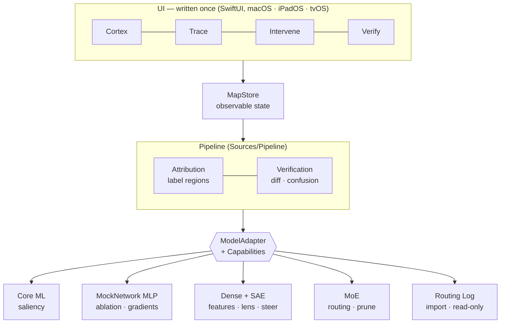

# Model Cartography

Turn an AI model into a place you can navigate — map its regions, trace a single
inference from input to output, and surgically target what to keep, cut, or replace.

One SwiftUI codebase, three platforms: **macOS · iPadOS · tvOS**.

This repository implements a complete, self-contained interpretability design: the five-stage pipeline
(Instrument → Capture → Attribute → Map → Intervene), Map B (interpretable features), logit
lens, attribution, steering, a native Mixture-of-Experts model with router-driven expert
pruning, and an importer for an external engine's routing log — all behind **one adapter
interface** spanning five very different model types without a rewrite.

---

## The idea in one paragraph

The app never touches a model directly. It only ever sees a normalized **Cartography Map**
(regions, edges, activations, traces) produced by a thin per-architecture **`ModelAdapter`**.
Each adapter *declares* what it can honestly do via `capabilities`, so the tool degrades
gracefully instead of faking a capability the model can't support. Write the UI, the tracer,
and the optimizer once; add a new architecture by writing one adapter.

## Architecture



Everything above the interface is architecture-agnostic; everything below it is one small,
self-contained adapter. The dashed contract in the middle — `ModelAdapter` + `Capabilities` —
is the whole design: get it right and each new model is an addition, not a rewrite.

### Capabilities by adapter

| Capability | Core ML | MockNet | Dense+SAE | MoE | Routing Log |
|---|:--:|:--:|:--:|:--:|:--:|
| internal activations | | ✓ | ✓ | ✓ | ✓ |
| saliency | ✓ | ✓ | | | |
| semantic features (Map B) | | | ✓ | | |
| logit lens | | | ✓ | ✓ | |
| attribution | | | ✓ | ✓ | |
| routing path | | ✓ | ✓ | ✓ | ✓ |
| ablation / pruning | | ✓ | | ✓ | |
| steering | | | ✓ | | |
| verification | ✓ | ✓ | ✓ | ✓ | ✓ |

The UI reads this table at runtime: Intervene shows steering, ablation, or a read-only
diagnostic — or an honest "unsupported" card — purely from what each adapter declares.

## Map of the code

| Piece | File | Role |
|---|---|---|
| Normalized vocabulary | `Sources/Core/CartographyTypes.swift` | Region, Edge, Trace, Feature, SaliencyMap |
| The one interface | `Sources/Core/ModelAdapter.swift` | protocol + `Capabilities` option set |
| Reference adapter (Phase 1) | `Sources/Adapters/MockNetwork/` | a real MLP trained in pure Swift — **fully** introspectable |
| Honest-degradation adapter | `Sources/Adapters/CoreML/CoreMLAdapter.swift` | wraps a Core ML classifier; occlusion saliency; **no** internal ablation |
| Dense adapter (Phase 2) | `Sources/Adapters/DenseText/` | residual model + sparse autoencoder → features, logit lens, attribution, steering |
| MoE adapter (Phase 3) | `Sources/Adapters/MoE/` | our own router + experts → routing cortex, expert attribution, utilization pruning |
| Routing-log adapter | `Sources/Adapters/RoutingLog/` | imports an external MoE engine's JSON routing log → mapped, labeled cortex + verification |
| Attribution | `Sources/Pipeline/Attribution.swift` | labels each region with the class it prefers |
| Verification | `Sources/Pipeline/Verification.swift` | ablate → re-verify on held-out data + collateral detection |
| UI | `Sources/App/` | Cortex map · Trace view · Intervene panel · Verify (health + confusion) |

### Two adapters, on purpose

- **Demo Net** (`MockNetworkAdapter`) — an 8×8 → 16 → 16 → 3 classifier trained on synthetic
  line patterns. Because we own the graph, it supports the *full* capability set: internal
  activations, true gradient saliency, and real per-neuron ablation. It exists to prove the
  entire loop end-to-end.
- **Core ML** (`CoreMLAdapter`) — wraps any Core ML image classifier via Vision. Core ML is a
  black box for internal activations, so this adapter advertises only `.saliency`
  (forward-only occlusion) and `.verification`. The Intervene panel then *hides* internal
  ablation rather than pretending — the honest-degradation design in action.

## Build & run

Requires Xcode 16+ (Swift 6) and [XcodeGen](https://github.com/yonaskolb/XcodeGen).

```sh
xcodegen generate
open ModelCartography.xcodeproj
# pick the My Mac / iPad / Apple TV destination and Run
```

The project file is generated from `project.yml` and git-ignored; regenerate any time.

### Verifying the pipeline without a full app build

The core is pure Swift with no UI dependency, so the whole loop can be compiled to a CLI and
exercised directly (useful in CI or a headless VM):

```sh
swiftc -O Sources/Core/*.swift Sources/Adapters/MockNetwork/*.swift \
  Sources/Pipeline/*.swift your_main.swift -o check && ./check
```

A representative run: the net trains to ~95% held-out accuracy, neurons develop clean
single-class selectivity, and group-ablating every "horizontal" neuron drops that class ~25%
while the harness flags `horizontal` as collateral damage.

## Using it

1. **Cortex** — columns are layers, cells are regions, brightness is activation for the
   current input. A teal ring marks the routing path; tap hidden neurons to mark them for
   ablation.
2. **Trace** — pick an input, watch it flow to a prediction, see per-class probabilities, the
   routing path, and a saliency overlay.
3. **Intervene** — quick-mark a whole domain (or hand-pick neurons), then **Ablate & Re-verify**.
   The result diffs before/after accuracy per class and flags any good class you damaged.
4. **Verify** — a report card for any model: overall + per-class accuracy and a confusion matrix.

**Simplify toggle.** Every tab has a **Simplify** button (top-right). Turn it on and the same
screens re-label themselves in plain language — "logit lens" → "how the guess takes shape",
"ablate" → "remove & recheck", "collateral damage" → "this broke something that was working" —
so you don't need to be a research scientist to read it. The data shown is identical; only the
words change.

## Phase 2 — the dense model (`Sources/Adapters/DenseText/`)

A small **dense residual classifier** over a synthetic topic corpus (weather / finance / food),
trained on-device in pure Swift. Because a real 7B LLM can't run in a VM — or on a TV — this
model is the stand-in that makes each Phase 2 *technique* real and inspectable:

- **Map B — features.** A **sparse autoencoder** trains on the model's residual stream and
  recovers an overcomplete dictionary of directions. Each feature is **auto-labeled** by the
  inputs that most activate it (e.g. `finance: invest, stock`). For a dense model these
  features *are* the cortex — the meaningful domains live in activation space, not in raw
  neurons.
- **Logit lens.** The classifier head is applied to every residual point, so you watch the
  running prediction sharpen with depth (e.g. `P(finance)` 30% → 84% → 100%).
- **Attribution graph.** The predicted logit is decomposed over features via
  `feature_activation × (head · feature_direction)` — a first-order account of how this input
  became this output.
- **Steering.** Adding `gain × feature_direction` to the residual at inference pushes behavior
  without retraining — enough to flip a *food* sentence to *finance*.

All four appear in the UI: features in the **Cortex** and **Trace** tabs, the logit lens and
attribution in **Trace**, and steering in **Intervene** (which swaps its ablation controls for
steering controls based on the adapter's declared `capabilities`).

## Phase 3 — Mixture-of-Experts (`Sources/Adapters/MoE/`)

Colibrì's *method*, as **our own model** — not a wrapper around their engine. A small MoE
classifier built end-to-end in Swift: each layer has a **router** that scores every expert for
the current input and a set of independent **expert** sub-networks, mixed by gate weight and
added as a residual. Trained with dense (soft) gating so it's differentiable; sparsity and
routing are read off the learned gates.

This is where "route the input to the right sub-network" is *literally the architecture*:

- **Routing is the cortex.** Regions are experts; a cell's brightness is the router gate for
  the current input; the top expert per layer is the realized **pathway**
  (`L0.E4 → L1.E0 → finance`).
- **Annotated brain.** Attribution over the corpus labels each expert with the domain that
  routes to it — the labeled cortex the design promised, versus Colibrì's unlabeled heatmap.
- **Utilization → pruning.** The Intervene tab ranks experts by how much the router uses them
  and offers **Mark cold experts**; pruning them and re-verifying shows near-zero damage, while
  pruning the hot *finance* experts collapses that class (−100%) and flags the collateral. That
  is expert pruning / pinning — optimization by usage.
- Plus the shared machinery: logit lens across MoE layers and per-expert attribution.

## Unified verification (`Verify` tab)

One held-out check every classifier adapter reports the same way, regardless of architecture:
overall + per-class accuracy, and a **confusion matrix** showing exactly which classes the model
mixes up (rows = actual, columns = predicted, diagonal = correct). Paired with the per-intervention
before/after diff on the Intervene tab, this is the closed loop that makes removing "unuseful"
regions measurable rather than reckless.

## Importing an external engine's routing (`Sources/Adapters/RoutingLog/`)

The bridge back to the original Colibrì reference — but instead of wrapping their engine, we
define the **JSON routing log** an MoE engine emits (per-input, per-layer expert gates + the
prediction) and *import* it. **Import Log** loads a sample (generated from our MoE and
round-tripped through JSON to prove the path); **Load Log…** (macOS/iOS) opens any file in the
schema. See [`docs/sample-routing-log.json`](docs/sample-routing-log.json) for the exact shape.

An imported log carries no weights, so the adapter declares only
`internalActivations · routingPath · verification`: you get the mapped cortex, the same
Attribution stage **labels its experts**, and the Verify tab scores it against the logged
predictions — but Intervene is read-only (identifying cold experts is fine; pruning or steering
needs the live engine). That is the honest-degradation design reaching all the way to a model
we never actually run.

**Every design item is now built.** The `ModelAdapter` interface spans a Core ML classifier, a
pure-Swift MLP, a dense residual model with a sparse autoencoder, a native MoE, and an imported
routing log — one UI, degrading per declared capabilities.

## License

This project is licensed under the **GNU Affero General Public License v3.0 (AGPL-3.0)** — see [`LICENSE`](LICENSE) and [`NOTICE`](NOTICE).

### Commercial Use

Commercial use of this software requires a separate commercial license. Contact **jmelton@americancode.org** to obtain one.

**What this means:**
- **Open-source use** — free to use, modify, and distribute under AGPL-3.0.
- **Commercial use** — requires a commercial license for, e.g.:
  - proprietary or closed-source products that embed this code,
  - SaaS/hosted offerings built on it, without releasing your source under AGPL-3.0,
  - enterprise use that can't meet AGPL-3.0's source-availability terms.

For commercial licensing inquiries, please contact: **jmelton@americancode.org**

Copyright (C) 2026 American Code.
